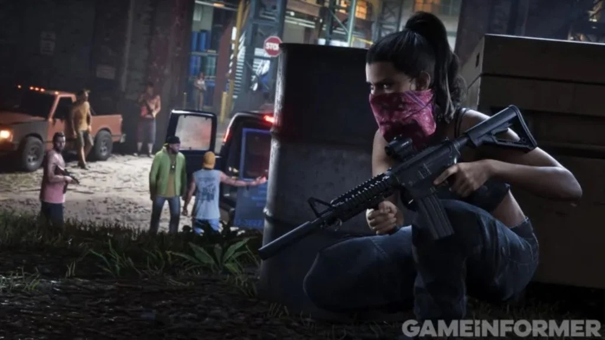
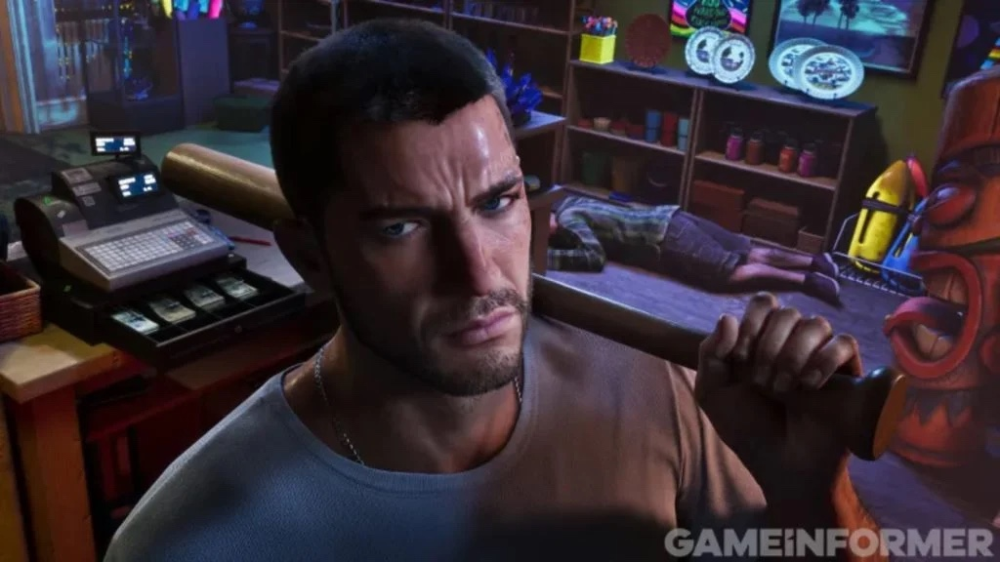
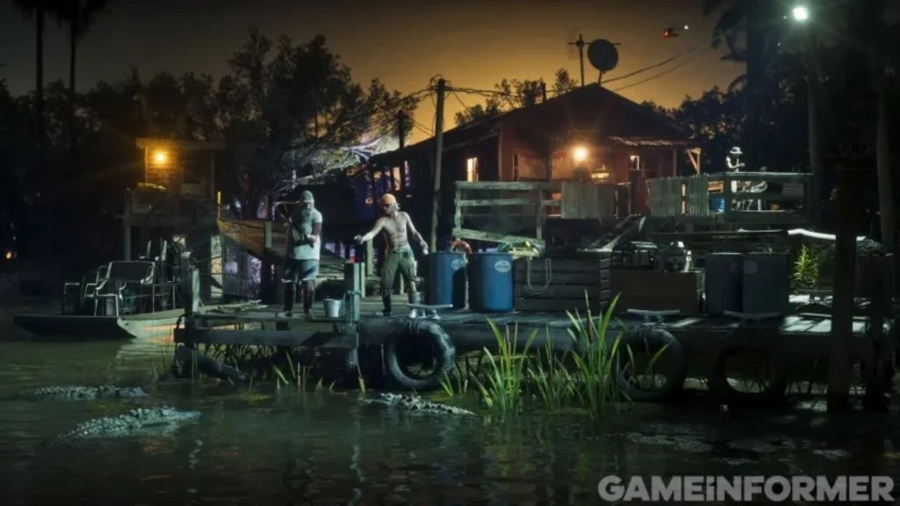
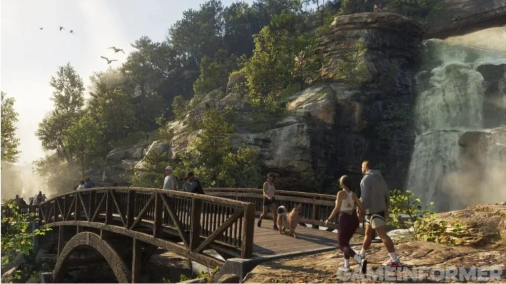
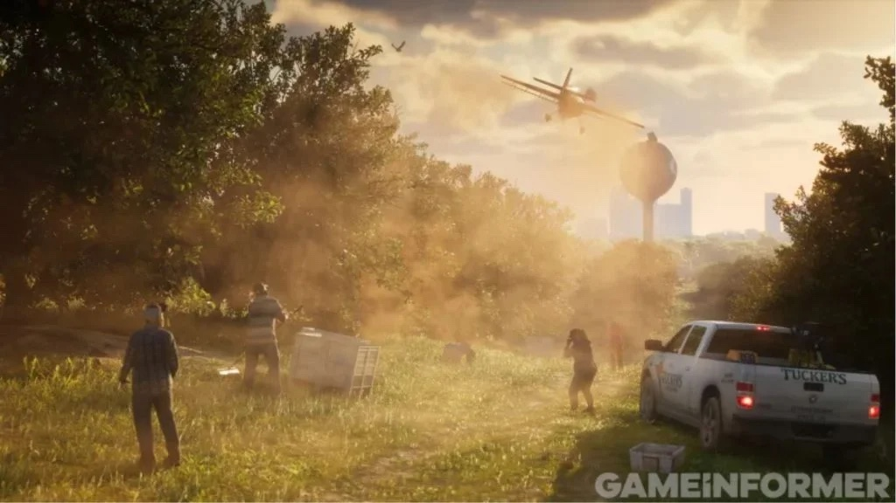
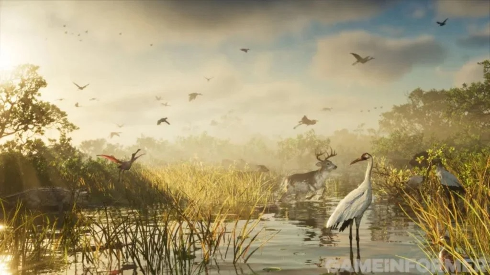

Game Informer hat 12 neue Screenshots von Grand Theft Auto VI veröffentlicht.
Sie gehören zu einer Titelgeschichte von 14 Seiten, für die das Magazin mit
Rockstar Games gesprochen hat. Die digitale Ausgabe erschien am 29. September.

Neben den Bildern geht es in der Geschichte um das Wetter, die Tiere von
Leonida und die Recherche von Rockstar in Florida. Jason Duval und Lucia
Caminos sind auf mehreren Screenshots zu sehen.

## Die Screenshots

Der Screenshot oben zeigt Jason auf einem Motorrad. Die anderen 11 folgen
hier.

<figure>

<figcaption>Game Informer, 29. September 2026.</figcaption>
</figure>

<figure>

<figcaption>Game Informer, 29. September 2026.</figcaption>
</figure>

<figure>

<figcaption>Game Informer, 29. September 2026.</figcaption>
</figure>

<figure>

<figcaption>Game Informer, 29. September 2026.</figcaption>
</figure>

<figure>

<figcaption>Game Informer, 29. September 2026.</figcaption>
</figure>

<figure>

<figcaption>Game Informer, 29. September 2026.</figcaption>
</figure>

<figure>

<figcaption>Game Informer, 29. September 2026.</figcaption>
</figure>

<figure>

<figcaption>Game Informer, 29. September 2026.</figcaption>
</figure>

<figure>

<figcaption>Game Informer, 29. September 2026.</figcaption>
</figure>

<figure>

<figcaption>Game Informer, 29. September 2026.</figcaption>
</figure>

<figure>

<figcaption>Game Informer, 29. September 2026.</figcaption>
</figure>

Grand Theft Auto VI erscheint am 19. November für PlayStation 5 und Xbox
Series X und S.
