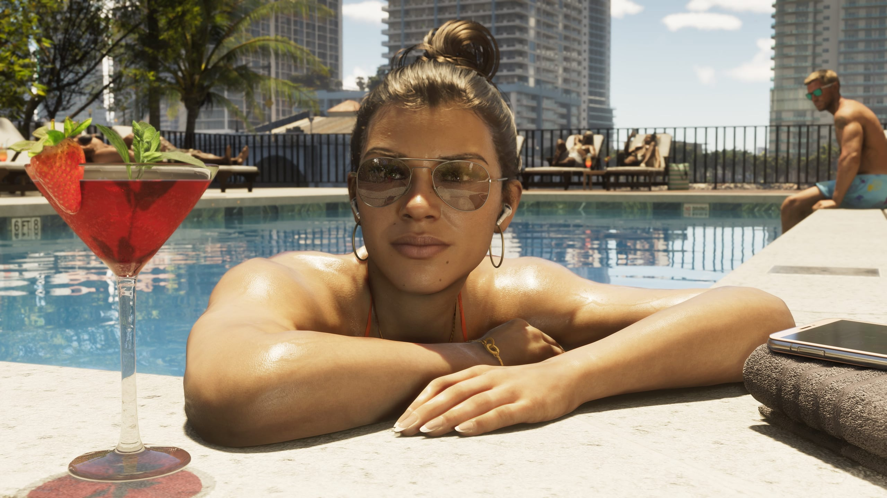

Darsteller, die in GTA VI zu hören sein sollen, wurden offenbar an ihre
Verschwiegenheitserklärung erinnert. Sie dürften ihre Rolle nicht vor dem
Erscheinungstag nennen. Die Meldung stammt vom Podcast GTA VI O'Clock.
Rockstar Games hat sie nicht bestätigt.

Der Podcast berichtet, eine Quelle habe eine Mail erhalten, in der das
Studio darauf hinweist, dass die Vereinbarung weiter gilt. Der zitierte Satz
lautet: "Wir möchten alle daran erinnern, an ihre Verschwiegenheitserklärung
zu denken. Das Datum, an dem Sie Ihre Beteiligung bekannt geben dürfen, ist
weiterhin der 19. November." Dexerto gab die Meldung weiter, danach IGN.

Die Nachricht lässt sich nicht unabhängig prüfen. Ob Rockstar diese Mails
verschickt hat, steht also nicht fest. Die Quelle vermutet, sie ging an
alle, die für das Spiel gespielt haben, und nicht nur an die Hauptrollen.

## Warum der Zeitpunkt passt

Stephen Root bestätigte vergangene Woche gegenüber der Associated Press,
dass er in GTA VI zu hören ist. Er ist bislang der einzige Darsteller, der
das selbst gesagt hat. Rockstar hat nie eine Besetzungsliste veröffentlicht.

<blockquote class="twitter-tweet" data-dnt="true">

Actor Stephen Root has broken his NDA confirming that he is playing Brian Heder in GTA 6.

<a href="https://twitter.com/GTASixInfo/status/2099378053042655445">GTA 6 Info (@GTASixInfo) auf X, 14. September 2026</a>

</blockquote>

Dass Root sprach, dürfte das Studio kaum überrascht haben. Fans hatten seine
Stimme längst erkannt. Root ist für King of the Hill bekannt, wo er Bill
Dauterive und Buck Strickland spricht. Laut dem Darsteller war das Geheimnis
schon weg, als seine Figur in früherem Material zu hören war: zu viele Leute
kannten seine Stimme aus dieser Serie, sagte er Dexerto.

Root sagte nur, dass er im Spiel ist. Brian Heder nannte er nicht, die
Figur, die Fans ihm seit Langem zuschreiben. Diese Verbindung stammt aus
seiner Stimme und aus dem bisher gezeigten Material. Auch diese Besetzung
hat Rockstar nicht bestätigt.

## Jason und Lucia bleiben ohne Namen

Um die beiden Hauptfiguren bleibt es auffällig still. Am häufigsten fallen
die Namen Manni L. Perez für Lucia und Dylan Rourke für Jason. Perez hat die
Gerüchte über ihre Beteiligung bestritten. Rourke hat sich, soweit bekannt,
öffentlich nicht geäußert.

<figure>

<figcaption>Lucia Caminos, in einem offiziellen Screenshot von Rockstar Games.</figcaption>
</figure>

Keine der beiden Personen hat Rockstar als Teil der Besetzung genannt. Eine
große offizielle Enthüllung vor dem Erscheinen wirkt nun unwahrscheinlich.
Hält das Studio das Geheimnis bis zum Schluss, bleibt eine Stelle, an der
die vollständige Besetzung sicher steht, und das ist der Abspann.

Für die Darsteller muss das nicht das Ende sein. Die Sprecher von GTA V
wurden in den Jahren nach dem Erscheinen zu bekannten Gesichtern in der
Community. Ned Luke, der Michael De Santa spielt, streamt und spielt noch
regelmäßig.
