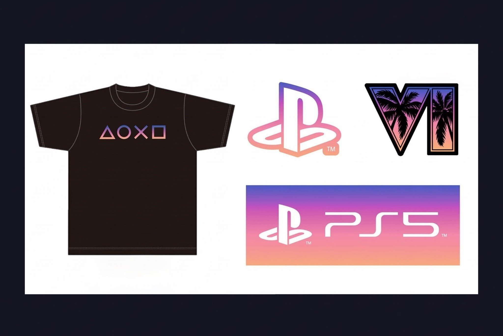

Ein kostenloses GTA-VI-Shirt hat auf der Tokyo Game Show für großen Andrang
gesorgt. Besucher bekamen eines, nachdem sie am Stand von PlayStation den
Extended Look gesehen hatten. Die Schlange schloss zehn Minuten nach der
Öffnung. Das Shirt wird inzwischen für über 200 Dollar weiterverkauft.

Die Attraktion am Stand von PlayStation war ein großer Bildschirm mit dem
aktuellen Extended Look, dazu Haptik und Raumklang. Wer die Vorführung bis
zum Ende sah, bekam ein GTA-VI-Shirt in limitierter Auflage und einen
separaten VI-Sticker. Dass die Ware gratis war, sprach sich über X herum,
schreibt IGN.

Am ersten Publikumstag wurde die Schlange nach zehn Minuten geschlossen, weil
der Stand seine maximale Kapazität erreicht hatte. Das zeigen Aufnahmen des
Streamers Jake Lucky.

<blockquote class="twitter-tweet" data-dnt="true">

The fight for the line at GTA 6 booth for Tokyo Game Show. The line was closed within 10 minutes of entry due to max capacity

<a href="https://twitter.com/JakeSucky/status/2101046098907566371">Jake Lucky (@JakeSucky) auf X, 18. September 2026</a>

</blockquote>

Das Shirt ist schwarz und trägt die vier Symbole von PlayStation in den
Sonnenuntergangsfarben von GTA VI. Auf dem beiliegenden Stickerbogen finden
sich ein PS5-Logo, ein PlayStation-Logo und das VI-Logo mit Palmen darin.

<figure>

<figcaption>Das Shirt und die Sticker, in einem Beitrag auf X vom 14. September 2026.</figcaption>
</figure>

## Für Hunderte Euro weiterverkauft

Die Shirts erreichten schnell den Gebrauchtmarkt. Schon an den Fachbesuchertagen
wurden auf der japanischen Auktionsseite Mercari Exemplare für mehr als
12.000 Yen angeboten, umgerechnet rund 76 Dollar, schreibt Kotaku.

Danach stiegen die Preise weiter. Dexerto gibt an, mehrere aktive und
verkaufte Angebote auf eBay geprüft zu haben. Ein Verkäufer aus Osaka soll
zwei Shirts für je 219,99 Dollar verkauft haben, inklusive Versand und
Einfuhrkosten. Das sind rund 190 Euro und damit mehr, als das Spiel selbst
kostet.

## Jede limitierte Auflage ist ausverkauft

Die Aufmerksamkeit passt zu dem, was das übrige GTA-VI-Merchandise erlebt.
Rockstar Games hat in den vergangenen Wochen mehrere Produkte angekündigt,
und jede limitierte Auflage war schnell weg.

Die DualSense-Controller in limitierter Auflage waren kurz nach dem Start der
Vorbestellungen in mehreren Shops ausverkauft, danach kam neuer Bestand. Der
limitierten Ausgabe von Grand Theft Auto VI: The Album erging es genauso.
Rockstar gab am 17. September bekannt, dass der Soundtrack am 19. November in
mehreren physischen Fassungen erscheint; die limitierte Vinylausgabe war kurz
darauf ausverkauft.

Wie viele Shirts in Tokio ausgegeben wurden, ist nicht bekannt, und ob das
Shirt anderswo noch verkauft wird, ebenfalls nicht. GTA VI erscheint am
19. November für PlayStation 5 und Xbox Series X und S.
