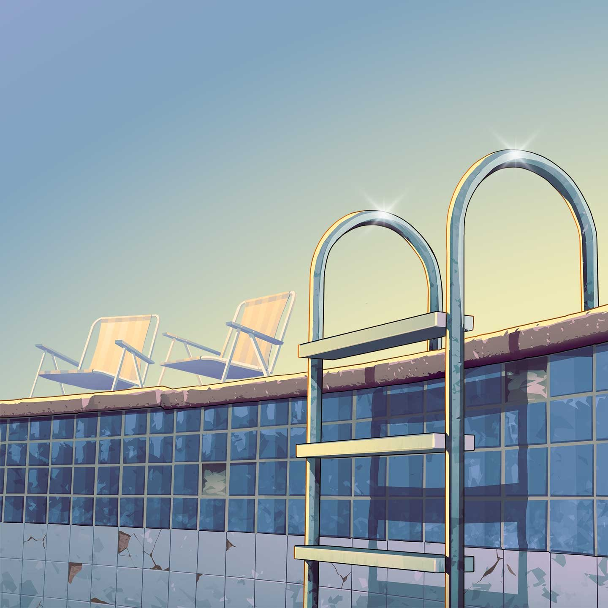
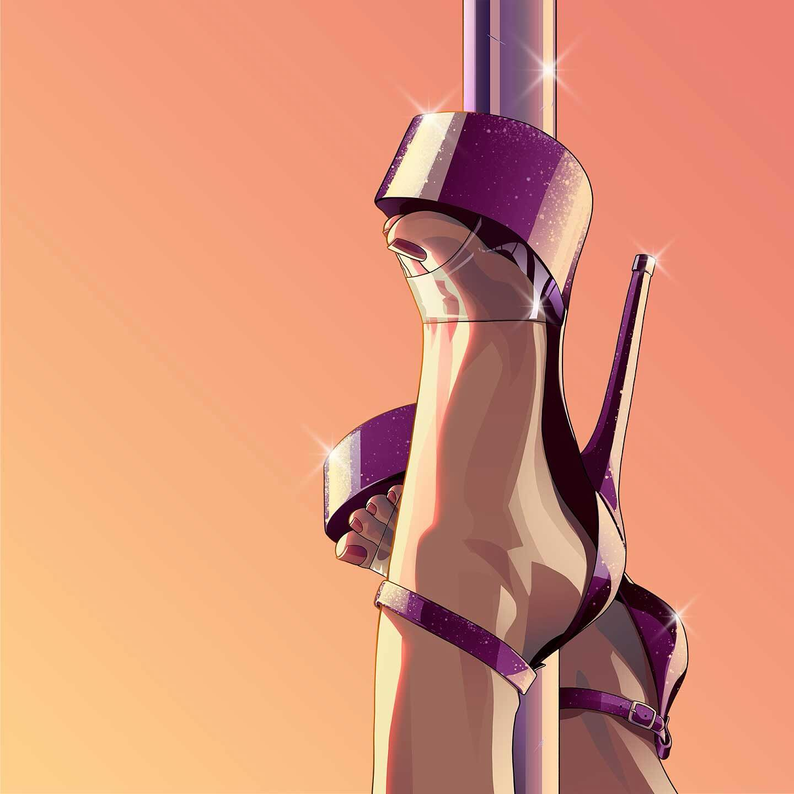
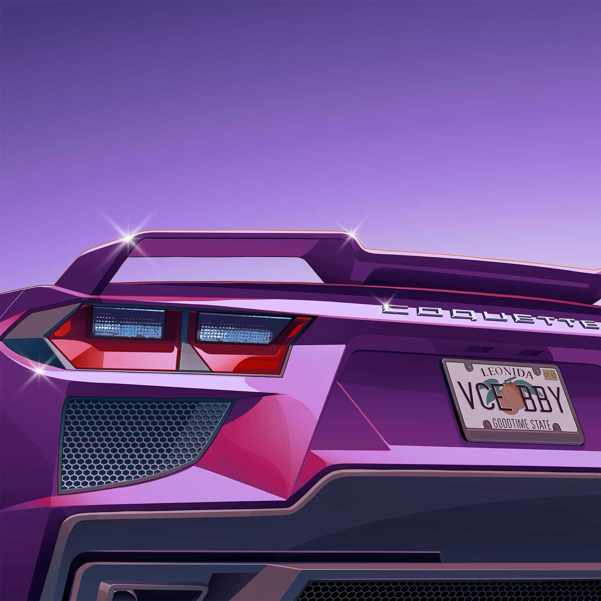
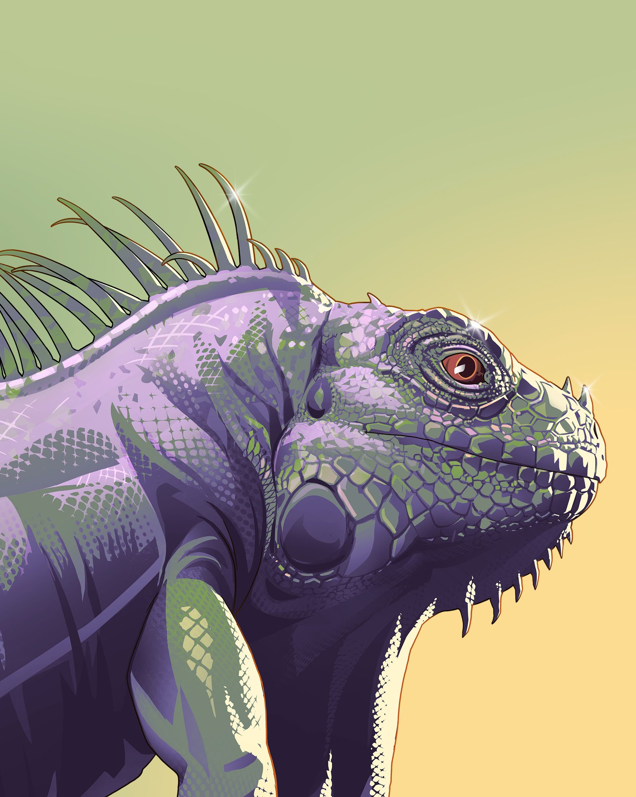

Five musicians posted teasers in the art style of GTA VI on 15 September. Fans
read them as the run-up to a music announcement, GameSpot reports. Rockstar
Games itself has said nothing. What the teasers point to is not known.

All five images share one look: flat illustration, sun colours, sharp
highlights. None of them carries a date or a title. Rockstar Games is not named
in any of the posts, except by Travis Scott, who tagged the studio.

## The five teasers

Country pop singer Morgan Wallen posted an image of a drained pool with two
sun loungers on the edge.

<figure>

<figcaption>Morgan Wallen on X, 15 September 2026.</figcaption>
</figure>

Rapper Travis Scott shared an image of high heels on a pole. He wrote "See yall
soon" and tagged Rockstar Games. His caption reads "Phase 1", which suggests
more is to come.

<figure>

<figcaption>Travis Scott on Instagram, 15 September 2026.</figcaption>
</figure>

The record label Freebandz posted the rear of a purple sports car. The licence
plate reads "VCE BBY" and carries the name Leonida, the state in which GTA VI
is set. The model name on the boot lid is Coquette, a car from earlier games.

<figure>

<figcaption>Freebandz on Instagram, 15 September 2026.</figcaption>
</figure>

Keith Richards of the Rolling Stones posted an iguana in purple and green. The
animal appears throughout Leonida, and Rockstar used it earlier in its own
artwork.

<figure>

<figcaption>Keith Richards on X, 15 September 2026.</figcaption>
</figure>

Puerto Rican singer Rauw Alejandro posted a pink inflatable flamingo at the
edge of a pool. GameSpot does not name him in its article, which lists four
teasers.

<figure>

<figcaption>Rauw Alejandro on Instagram, 15 September 2026.</figcaption>
</figure>

Whether the five posts were agreed upon in advance is unknown. Neither is
whether more will follow.

## Music has always been part of the series

Before this, fans thought they saw references to GTA VI in one of Scott's music
videos. The series is known for its radio stations with licensed music from
well-known artists. That is expected to return in GTA VI.

It was rumoured earlier that DJ Khaled would host his own station in the game,
according to GameSpot. Drake would get a station too. Rockstar has confirmed
neither.

Grand Theft Auto VI appears on 19 November for PlayStation 5 and Xbox Series X
and S. When a possible music announcement would follow is not known.
