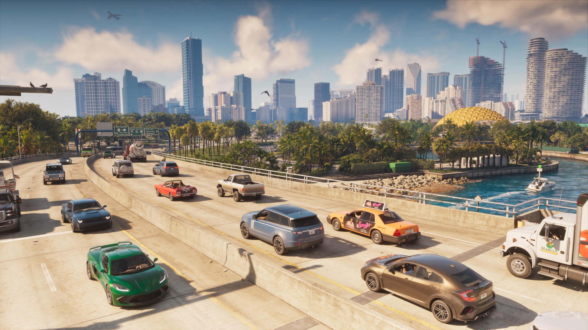
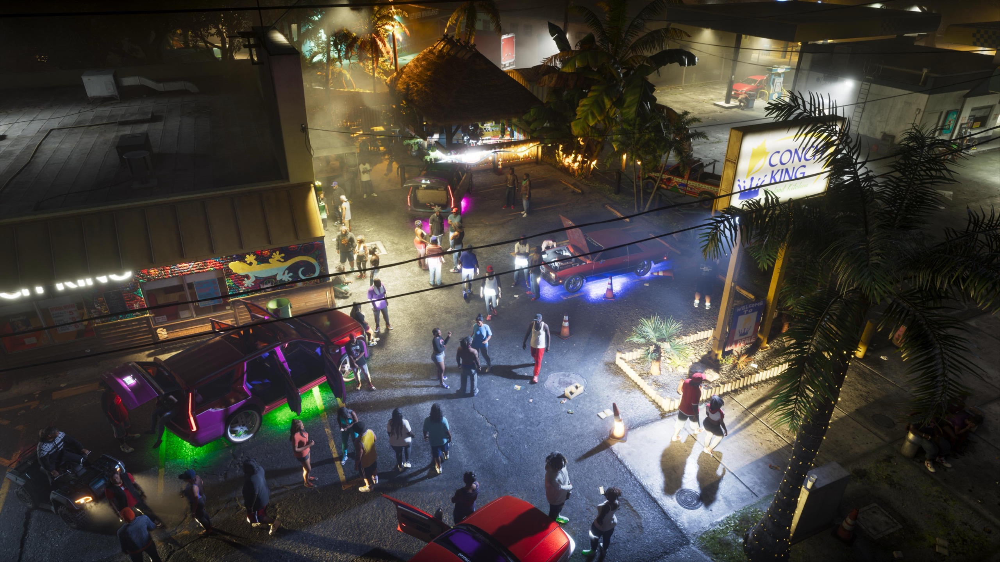
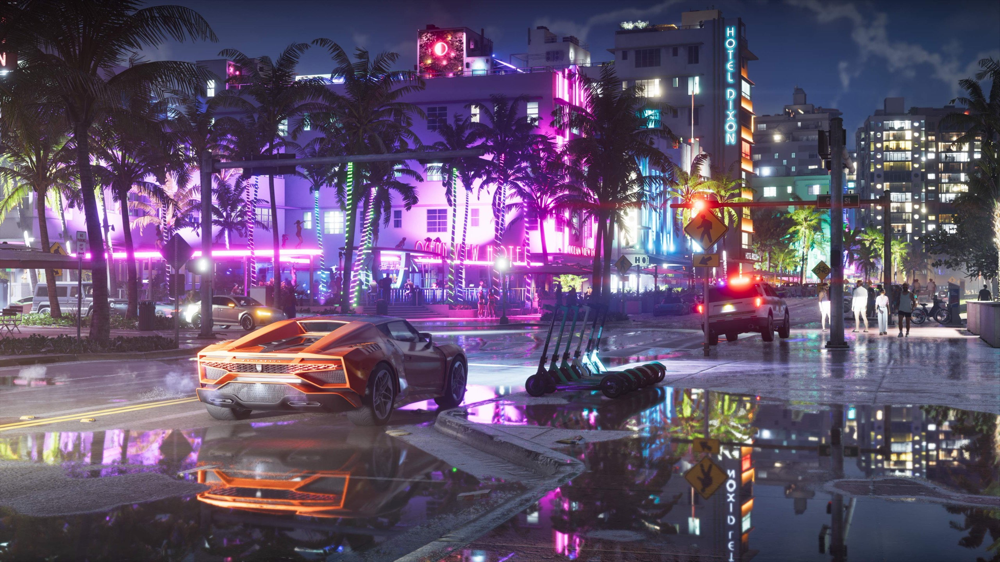

Rockstar Games has released three new screenshots of Grand Theft Auto VI.
They show a busy freeway, a car meet at night and a neon-lit street after the
rain. Fans mostly praise the reflections of the neon in the puddles.

The screenshots appeared on 8 October as backgrounds on the new music page of
the official website. That page also presents the first six radio stations of
the game. IGN Benelux reported on the images the same day.

## What the screenshots show

The first shows a freeway full of traffic, with the skyline of the city
behind it. Dozens of vehicles each seem to go their own way, IGN Benelux
notes, while birds and a plane fly overhead.

<figure>

<figcaption>The freeway, one of the three new screenshots. Official screenshot, Rockstar Games.</figcaption>

</figure>

The second shows a car meet at night, seen from above. A crowd stands between
cars with neon under their bodies, in the parking lot of a seafood restaurant
called Conch King. IGN Benelux points to the lighting and to the number of
passers-by.

<figure>

<figcaption>The car meet at Conch King. Official screenshot, Rockstar Games.</figcaption>

</figure>

## The detail fans noticed

The third screenshot draws the most attention from fans, according to IGN
Benelux. It shows a wet street at night with an orange sports car and a row of
electric scooters. The puddles reflect the pink and green palm trees and the
neon of the Hotel Dixon.

<figure>

<figcaption>The wet street at the Hotel Dixon, the screenshot fans talk about most. Official screenshot, Rockstar Games.</figcaption>

</figure>

It is a small detail. IGN Benelux sees it as a sign of how much care Rockstar
puts into the lighting and the surroundings of GTA VI.

## Which console is not known

Rockstar has not said on which console the screenshots were captured. It has
also not yet shared the resolution or frame rate for any console. GTA VI only
appears on consoles, including the less powerful Xbox Series S.

GTA VI appears on 19 November for PlayStation 5 and Xbox Series X and S.
