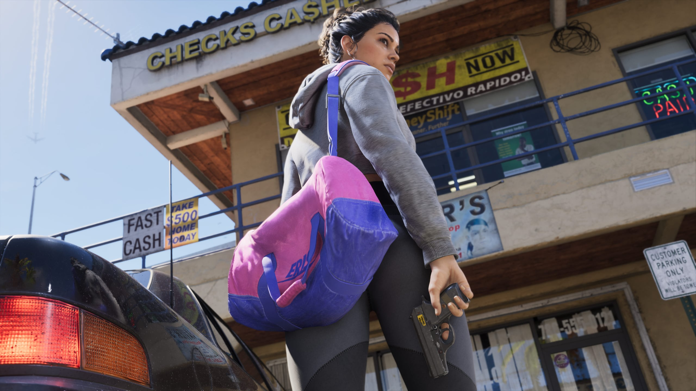

IGN ha publicado la entrevista completa con Rob Nelson, codirector del
estudio Rockstar North. Jugó 30 minutos de Grand Theft Auto VI para la web en
julio. Grandes partes de la conversación no se habían publicado nunca.

IGN visitó Rockstar North en julio y vio a Nelson jugar en directo. Rachel
Weber, responsable de desarrollo editorial en IGN, escribió un avance en
agosto, tras el vistazo ampliado en Netflix. Ese avance recogía los puntos
principales. La transcripción completa siguió inédita hasta el 7 de octubre.

La demo no seguía un guion fijo, escribe Weber. Varias cosas salieron de otra
manera de lo previsto, y Nelson hablaba mientras jugaba. Por eso la
conversación sigue a menudo lo que pasaba en pantalla.

Abajo va primero lo nuevo de la entrevista completa. Después, lo que el
avance de agosto ya mostraba, y por último lo que aún no se sabe.

## Un piso franco que es de otra persona

El piso franco de la demo no es la casa de Jason y Lucia, dice Nelson. Los
dos se alojan en casa de otra persona. De quién es la casa, no lo dice.

Según Nelson, los pisos francos se parecen más a los campamentos de Red Dead
Redemption 2 que a los pisos francos de cualquier GTA anterior. Eso vale
para lo interactivos que son y para lo mucho que se sienten como un hogar.

Al principio de la demo, Jason tiene el pelo más largo que en los tráileres,
señala IGN. Saca una bebida de la nevera y coge una novela romántica de una
mesa.

Jason tiene su propia rutina, dice Nelson. Cuando el jugador cambia a él, a
veces está en el piso franco y a veces fuera, por su cuenta. En la demo
resultó estar en la ducha.

## Un nuevo equipo de guionistas en Los Ángeles

Para las conversaciones de los transeúntes, Rockstar formó un equipo
totalmente nuevo de guionistas, directores y productores en Los Ángeles,
dice Nelson. El juego necesitaba más profundidad y variedad en esos diálogos
de lo que el estudio podía hacer antes.

Todos los equipos técnicos, de animación, de diseño y de guion tuvieron que
convertirse en estudiantes del comportamiento humano, según Nelson.
Estudiaron cómo sube y baja una conversación al pasar junto a dos personas.
El tamaño del equipo de Los Ángeles, no lo dice.

## Animaciones que se ajustan a cada cuerpo

Los juegos anteriores no podían mostrar tanta variedad de cuerpos, explica
Nelson. Cuerpos distintos tenían que compartir un mismo conjunto de
animaciones. Una persona baja y una alta no encajaban cuando peleaban o se
sentaban en un coche.

Para GTA VI, el equipo creó un sistema que adapta esas animaciones sobre la
marcha. Nelson lo relaciona con la memoria de las consolas actuales. El
juego se desarrolló para esta generación desde el principio.

## Nadie conoce el juego entero

El juego es tan grande que Nelson duda de que alguien del equipo lo conozca
entero. Todavía llegan con regularidad nuevos diálogos a la versión de
trabajo.

Durante la demo, Jason propuso robar en un depósito de la policía cuando la
pareja pasaba por delante. Nelson nunca había oído esa frase. Dejó su plan de
atracar una casa de empeños y fue a por el coche.

El equipo ha doblado su tamaño, en parte por la densidad del mundo, dice
Nelson. No da cifras. En julio el juego aún no estaba terminado, según
Nelson. El equipo iba a aprovechar cada momento que tuviera para pulirlo.

## La pareja al volante

Jason o Lucia puede conducir mientras el jugador dispara desde el otro
asiento. Cuando de verdad funciona, puede parecer una misión guionizada, dice
Nelson. Lo describe como algo totalmente nuevo para Rockstar.

Da dos ejemplos. Reventar las ruedas del primer coche patrulla puede hacerlo
volcar y bloquear a los coches de detrás. La pareja también puede ganarle a
un tren en el último segundo y cortar la persecución.

## Cuatro personajes estuvieron sobre la mesa

Tras GTA V, el equipo habló de cómo dar continuidad a tres personajes
jugables, dice Nelson. Una de las ideas era cuatro. La preocupación era que
los jugadores pasaran muy poco tiempo con cada uno, y se sintieran menos
unidos a ellos.

Eso llevó a dos personajes en pareja. La química es notoriamente difícil en
cualquier tipo de entretenimiento, dice Nelson. Según él, las reacciones
dentro del equipo muestran que funciona.

## Cuánto del personaje es el jugador

Nelson usa Red Dead Redemption 2 para explicar una idea que Rockstar lleva
más lejos en GTA VI. La pregunta es cuánto de un personaje es el personaje, y
cuánto es el jugador.

Algunos jugadores no entendían por qué Arthur Morgan seguía a Dutch. A ellos
no los había salvado Dutch a los quince años, a Arthur sí. Rockstar añadió
entonces que solo Dutch sabía dónde estaba el dinero de la banda. Eso daba a
los jugadores un motivo propio.

Muchas buenas acciones de Arthur eran al principio obligatorias, dice Nelson.
Rockstar las hizo opcionales, para que quienes las eligieran sintieran su
redención como propia. Algunas frases de Arthur en las cinemáticas también
cambian según el honor del jugador.

GTA VI sigue por ese camino, según Nelson. Jason y Lucia empiezan queriendo
dar una oportunidad a su relación. Jugar juntos las misiones de la historia
quizá no baste para mantenerlos unidos.

## La relación y la historia

Los jugadores que no mantengan juntos a Jason y Lucia los verán colaborar
igualmente durante la mayor parte de la historia, dice Nelson. Sus
circunstancias los obligan. Como mínimo, siguen siendo compañeros de
fechorías.

Nelson no quiere decir más, para no destripar nada. No se le ocurre ninguna
ventaja jugable de la relación romántica. Que la relación se haya cuidado sí
influye en cómo avanza su historia, dice.

La intimidad física es una parte importante de una relación y hay que
hacerla bien, según Nelson. El equipo sigue iterando hasta que se sienta
bien, y quiere evitar la caricatura. Cómo se ve en el juego, no lo muestra.

En GTA V, tres personajes vivían vidas separadas, dice Nelson. En GTA VI, los
jugadores se preguntan a menudo dónde está el otro, como en la vida real.
Jugar con los dos juntos se siente como cuidarlos como unidad, dice.
Rockstar no lo sabía cuando empezó.

## Decisiones pequeñas y grandes

La historia tiene muchas decisiones, grandes y pequeñas, dice Nelson. Las
pequeñas se suman. Algunas grandes pesan mucho en el momento en que se
toman. Cuántos finales hay, no lo dice.

Los cambios en un pueblo, como el aserradero de Red Dead Redemption 2, tienen
un papel menor en GTA VI. No son una parte tan grande de la historia, según
Nelson. A cambio, los jugadores pueden atracar casi cualquier cosa, como una
tienda que vende auriculares.

## Dónde empieza un GTA

La elección ocupaba un lugar destacado en la proverbial pizarra, dice
Nelson. La sátira no es lo primero en lo que piensa Rockstar. Primero va el
escenario: Miami y Florida, que se convirtieron en Vice City y Leonida.

Luego el equipo viaja allí y conoce a tanta gente como puede. Después vienen
las experiencias, lugares y personas que el jugador debe encontrar, y un
grupo de personajes que lo sostenga. Solo entonces el equipo mira qué
mejorar.

Dos cosas destacaron para GTA VI, dice Nelson: la elección, y unir quién es
el jugador en la historia con quién es en el mundo abierto.

## Nada de jerga de moda

Como el desarrollo dura tanto, Rockstar no se lanza sobre la actualidad,
dice Nelson. Los temas políticos muy concretos y los memes envejecen rápido.
Los temas más amplios sí se prestan a la sátira.

Los personajes también evitan la jerga muy actual, según Nelson. Jason y
Lucia tienen cierta edad, pero deben sentirse algo atemporales. Rupert
Humphries, senior vice president of narrative, dijo algo parecido en LOVE
magazine a principios de esta semana.

El pasado de Jason y Lucia solo se cuenta en parte en el juego, dice Nelson.
Una parte se dice abiertamente, otra solo se insinúa. El equipo dejó espacio
para la interpretación a propósito, para que los jugadores conecten con ellos
más fácilmente.

## Detalles menores de la demo

- Lucia se esconde en una tienda de barrio y compra una gorra y chicle,
  mientras un policía pasa por fuera.
- Una cruz amarilla marca a alguien que está inconsciente y no se levantará.
- La adrenalina ayuda a escapar de la policía.
- Comprar y ponerse un conjunto nuevo en una tienda elimina toda la presión
  policial.
- Cada arma comprada está siempre en la parte trasera del vehículo personal.
- Jason y Lucia pueden entrenar juntos, y las estadísticas de los dos suben a
  la vez.
- Los jugadores pueden meterse en el contenedor con el hombre que da consejos
  legales.
- Mantener abajo en la cruceta fija un punto de ruta.
- Un coche dañado se puede reparar antes de entregarlo, porque el perista
  paga menos por él. El escáner también muestra lo que pagaría un Pay 'n'
  Spray.
- La demo empezó en la casita de Jason, y en 30 minutos Nelson no llegó a la
  playa.

## Lo que el avance de agosto ya mostraba

Gran parte de la jugabilidad de la demo ya se conocía por el avance de
agosto. La web nunca escribió sobre ese avance, así que los puntos
principales van abajo, tal y como Nelson los explica en la entrevista
completa.

### La policía

La policía solo sabe de un delito si alguien lo ve o si salta una alarma. El
lugar se convierte entonces en una zona caliente en el mapa. Una estrella se
despista con facilidad, y la central sabe con mucha precisión lo que pasó,
dice Nelson.

La policía recuerda lo que el jugador lleva puesto y conduce, y sabe que
busca a una pareja. Una gorra y unas gafas no bastan, un conjunto nuevo sí.
Se puede guardar ropa de recambio en el maletero. Otro coche y separarse
también ayudan.

Las estrellas blancas huecas significan que la policía no sabe quién es el
jugador. Los callejones estrechos y huir a pie suelen ser la mejor salida con
tres estrellas en la ciudad. Quien es arrestado ve Busted y reaparece, como
en juegos anteriores.

### El Criminal Profile

El Criminal Profile registra qué tipo de criminales son Jason y Lucia. Es
distinto del honor de Red Dead Redemption 2, dice Nelson. Lo que exige una
misión o un atraco está permitido. La violencia innecesaria, una y otra vez,
puede empujar el perfil en una dirección concreta.

Eso puede influir en cómo reacciona el mundo y cómo avanza la historia. No
hay una forma correcta o incorrecta de jugar, según Nelson. La relación entre
Jason y Lucia es un sistema aparte.

### Robar coches

No todos los coches aparcados se pueden robar enseguida. Algunos requieren
herramientas que llegan más tarde en la historia, como una ganzúa slim jim o
un clonador de llaves. Sacar a un conductor de su coche siempre funciona.

Un escáner en el teléfono muestra si un coche está cerrado, si tiene alarma o
localizador, y cuánto vale. Con un localizador avanzado, el coche tiene que
mantener la velocidad o la policía lo encuentra. Las calles son más estrechas
y de escala más realista que antes, dice Nelson.

### Dinero y atracos

El dinero importa más que en los GTA anteriores, según Nelson. Algunas partes
de la historia exigen ganar dinero primero. Tiendas, bancos y locales de
préstamos rápidos se pueden atracar, en solitario o juntos.

<figure>

<figcaption>Captura oficial, Rockstar Games.</figcaption>

</figure>

Una caja fuerte se puede volar, pero eso daña parte del botín. El código
también se puede encontrar en el edificio. El botín, como las joyas, va a un
perista. Un perista dio a Jason y Lucia el código del depósito de la demo.

### La vida diaria en Leonida

Jason y Lucia pueden escribirse y llamarse en cualquier momento. Ignorar un
mensaje puede dañar un poco la relación. Manteniendo R2 se dan la mano, y se
sujetan la puerta el uno al otro.

En casa, el pelo solo se puede acortar. Los peinados nuevos vienen de
peluquerías y barberías, cada una con estilos propios. Comer da un buen
impulso a la salud, comer demasiado engorda y el gimnasio da músculo.

Ryde Me, la versión de Uber del juego, sirve de viaje rápido, con charla con
los demás pasajeros. Snapmatic sirve para mirar y seguir, no para publicar,
ya que los dos están huyendo. Hay más anuncios de radio y televisión que
nunca.

Focus funciona como Eagle Eye en Red Dead Redemption 2 y muestra objetos y
policía. Los animales se pueden estudiar, como colección. La gente nota
cuando alguien escucha a escondidas o la sigue, y puede volverse agresiva.
Lucia siempre se une a una pelea de Jason, y al revés.

### Misiones

La huida del bloque de pisos del vistazo ampliado tiene varias rutas. En la
misión con Raul, el jugador dispara primero mientras Lucia conduce, y luego
toma el volante. Hay una salida sugerida de la persecución, pero no es
obligatoria.

La tobillera electrónica de Lucia forma parte de la historia y de cómo se
juntan Jason y Lucia, dice Nelson. No explica más.

## Lo que aún no se sabe

- De quién es el piso franco de la demo.
- Qué pasa cuando la relación de Jason y Lucia se rompe. Nelson no quiso
  decir más.
- Cómo muestra el juego la intimidad física.
- Hasta dónde cambia la historia el Criminal Profile.
- Cuántos finales hay.
- Qué significa para la historia la tobillera electrónica de Lucia.
- Lo grande que es el nuevo equipo de Los Ángeles, y cuántas personas
  trabajan en el juego.
- Qué ha cambiado en el juego desde la demo de julio.

Grand Theft Auto VI sale el 19 de noviembre para PlayStation 5 y Xbox Series
X y S.
