Los Miami Heat juegan como Vice City el 18 de noviembre, la víspera del
lanzamiento de Grand Theft Auto VI. El partido contra los Milwaukee Bucks
tendrá su propia cancha y un uniforme nuevo. El club lo anunció en su web.

Los Heat llaman a la noche "A Night in Vice City". El club habla de una
alianza histórica y de un evento que nunca se ha hecho antes. El partido en
el Kaseya Center empieza a las 19:00, hora local. En Bélgica y los Países
Bajos será la 1:00 del 19 de noviembre, el día en que sale GTA VI.

<figure>

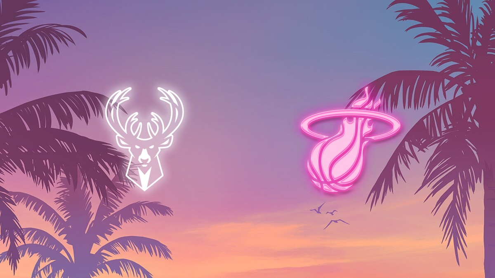

<figcaption>Miami Heat, nba.com.</figcaption>

</figure>

## El partido contra los Bucks

ESPN y el canal local WPLG Local 10 emiten el partido por televisión. En la
radio se escucha en 560 WQAM y en la emisora en español Radio Mambí 710 AM.
Las entradas se venden a través de Ticketmaster. En la página de los Heat,
el recinto figura como Kaseya Center - Vice City.

<figure>

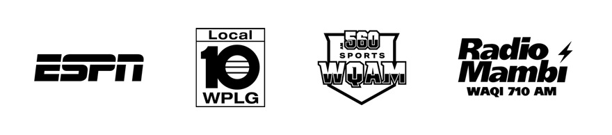

<figcaption>Miami Heat, nba.com.</figcaption>

</figure>

La imagen de arriba es un fotograma de un vídeo de dron de la misma página.
Muestra el pabellón de noche, con "Welcome to Vice City VI" en el techo y
luz rosa alrededor de la entrada. Ese cartel se encendió por primera vez el
1 de octubre.

## Una cancha para una sola noche

Los Heat juegan sobre un parqué construido especialmente para Vice City,
solo por una noche. Por ahora el club solo muestra un avance borroso con luz
rosa. Todavía no se sabe cómo es la cancha.

<figure>

<figcaption>Miami Heat, nba.com.</figcaption>

</figure>

En el Kaseya Center también habrá actividades especiales, a partir de la
Opening Night, el primer partido en casa de la temporada. El 18 de
noviembre habrá más. Los Heat prometen más detalles y aún no dicen en qué
consisten las actividades.

<figure>

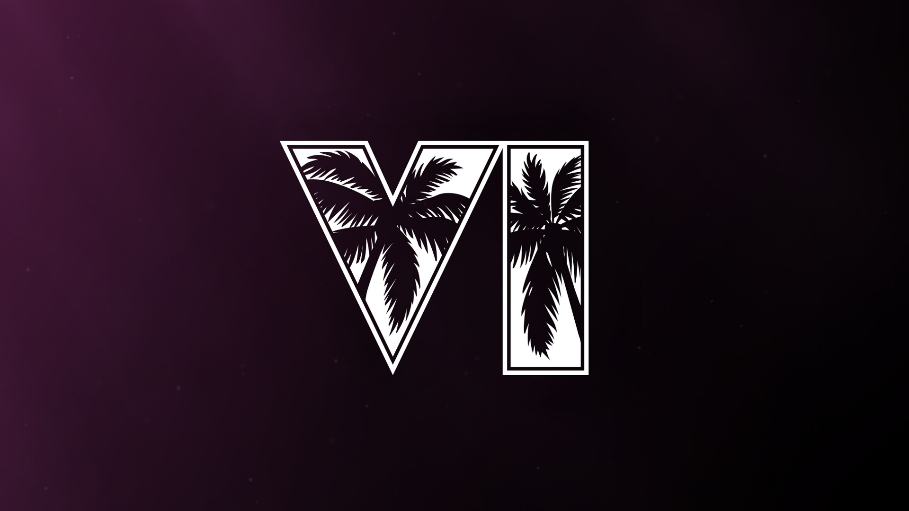

<figcaption>Miami Heat, nba.com.</figcaption>

</figure>

## Un uniforme nuevo

Para esa noche, los Heat llevarán un uniforme nuevo, completamente
reinventado. Todavía no se ha mostrado. La página solo muestra la silueta de
un jugador sobre fondo rosa, con un registro para el momento en que se
presente. El título de la página lo llama el uniforme Vice City Edition
2026-27.

<figure>

<figcaption>Miami Heat, nba.com.</figcaption>

</figure>

Los Heat llevan uniformes llamados Vice desde la temporada 2017-18. Se
inspiran en la serie de televisión Miami Vice de los años 80, con rosa y
azul neón.

## La colección Vice City

Ya hay una línea de ropa a la venta. La colección Court Culture Vice City
está disponible en la tienda de los Heat en el Kaseya Center y en línea.
Court Culture es la marca de ropa de los Heat. La etiqueta del cuello de las
camisetas lleva el logo de GTA VI junto al de los Heat.

<figure>

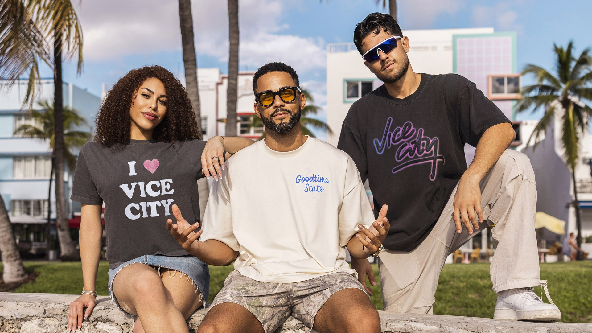

<figcaption>Miami Heat, nba.com.</figcaption>

</figure>

En la página aparecen cuatro prendas. Los precios están en dólares:

* **Vice City Grill Oversized Tee**, 55 dólares, unos 47 euros. Una camiseta negra con una boca llena de dientes de oro y las palabras Welcome to Vice City.
* **Vice City Souvenir Oversized Tee**, 55 dólares. Una camiseta blanca con "Went to Vice City and all I got was this lousy t-shirt!" en la espalda.
* **I 🩷 Vice City Crop**, 45 dólares, unos 39 euros. Una camiseta corta y oscura con un corazón rosa lleno de palmeras.
* **Vice City Pool Service Pocket Tee**, 55 dólares, hecha con la marca Duvin. En la espalda, un caimán en una piscina con una canasta, el lema "Leonida's Finest!" y el número 1-999-VICECITY.

<figure>

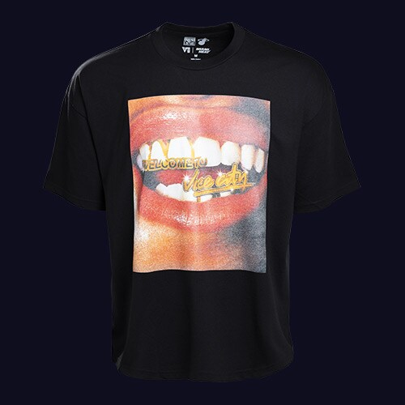

<figcaption>Miami Heat, nba.com.</figcaption>

</figure>

<figure>

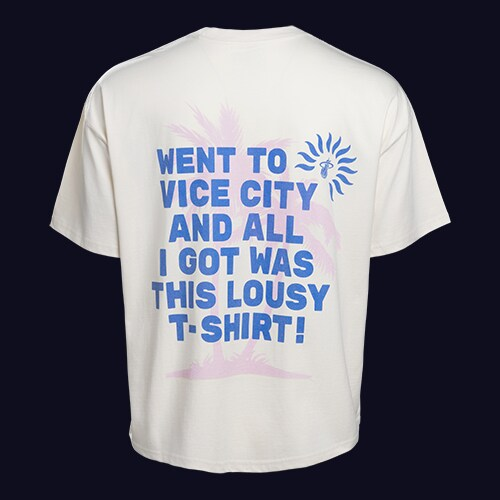

<figcaption>Miami Heat, nba.com.</figcaption>

</figure>

<figure>

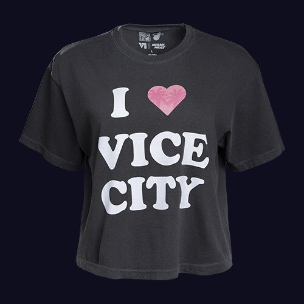

<figcaption>Miami Heat, nba.com.</figcaption>

</figure>

<figure>

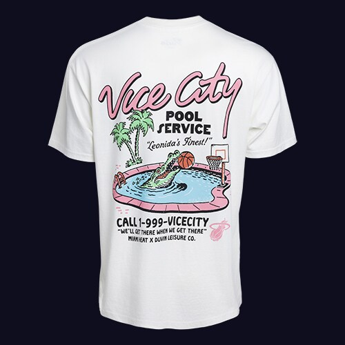

<figcaption>Miami Heat, nba.com.</figcaption>

</figure>

Las fotos de la campaña muestran las camisetas en Miami: en una calle con
hoteles art déco, junto a una torre de socorristas en la playa y a la
orilla del agua. Los Heat dicen que llegarán más artículos.

<figure>

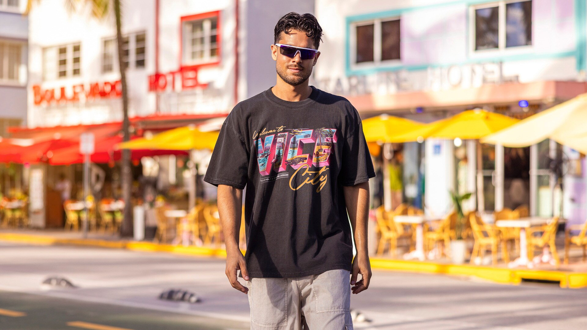

<figcaption>Miami Heat, nba.com.</figcaption>

</figure>

<figure>

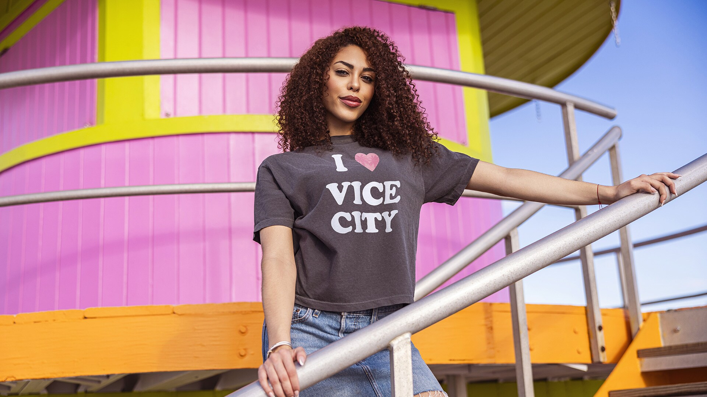

<figcaption>Miami Heat, nba.com.</figcaption>

</figure>

<figure>

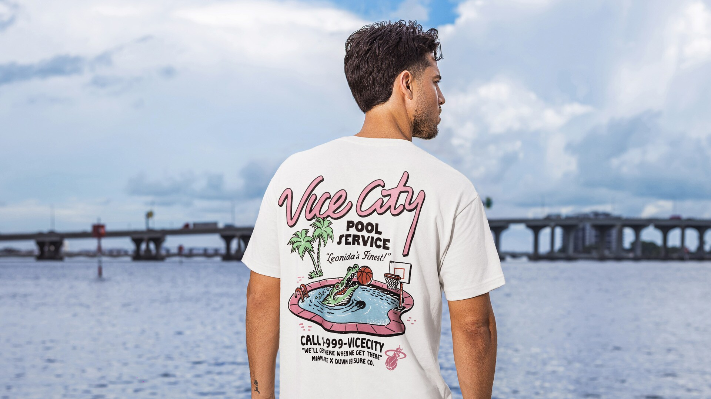

<figcaption>Miami Heat, nba.com.</figcaption>

</figure>

## Parte de una campaña mayor

La noche llega después del cartel "Welcome to Vice City" en el techo del
Kaseya Center. Rockstar Games paga por él 975.000 dólares, unos 840.000
euros, al condado de Miami-Dade, propietario del pabellón. La página no dice
si Rockstar también paga por la noche del partido.

La página de los Heat termina con un vídeo de dron del horizonte de Miami al
atardecer.

<figure>

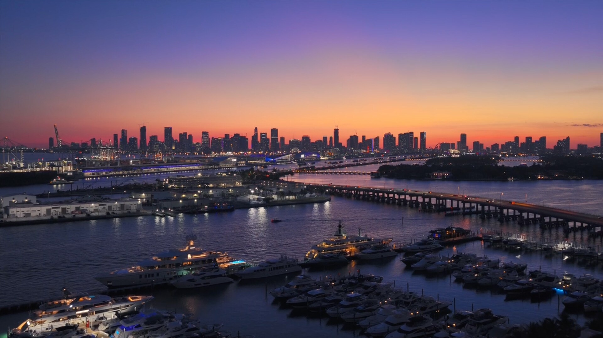

<figcaption>Fotograma de un vídeo. Miami Heat, nba.com.</figcaption>

</figure>

GTA VI sale el 19 de noviembre para PlayStation 5 y Xbox Series X y S.
