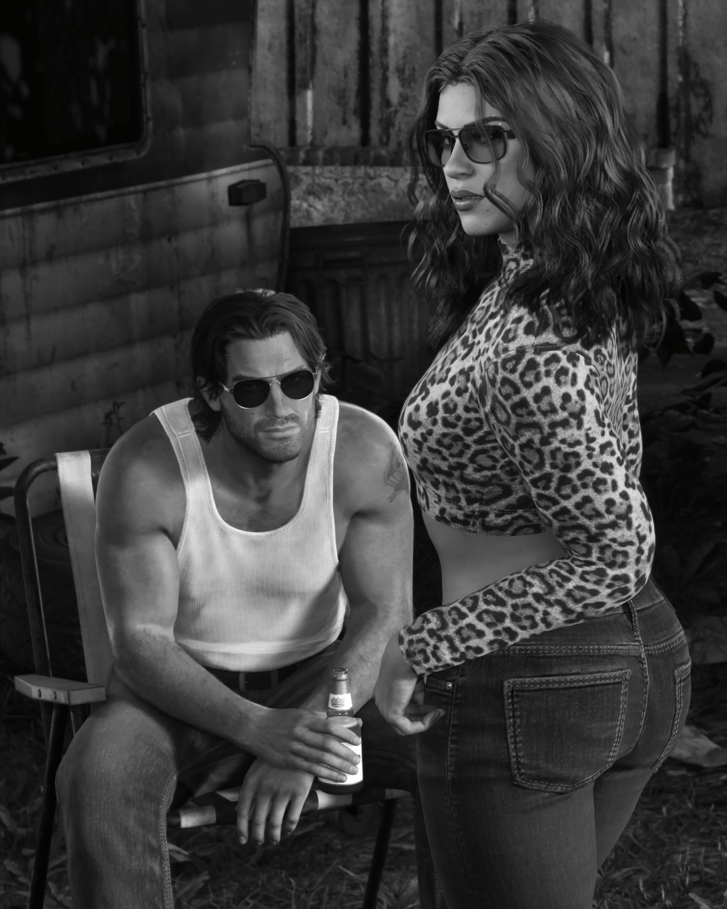
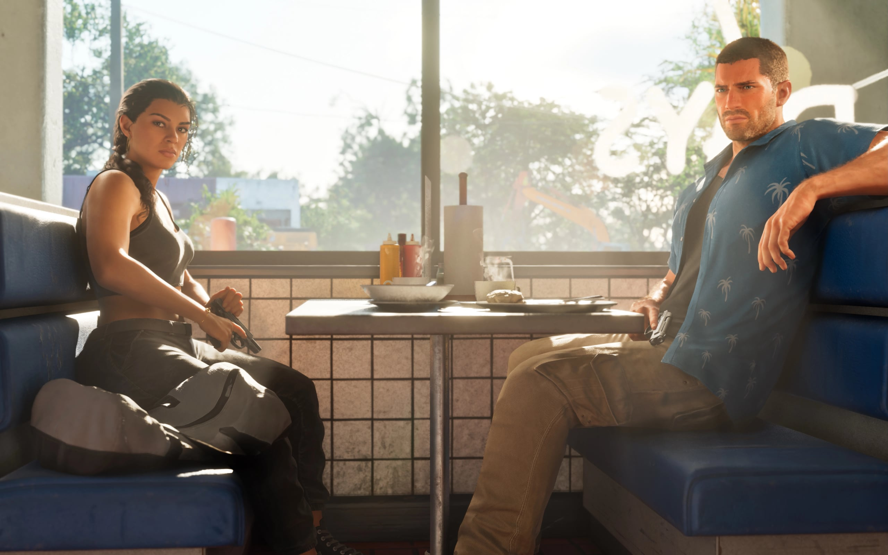
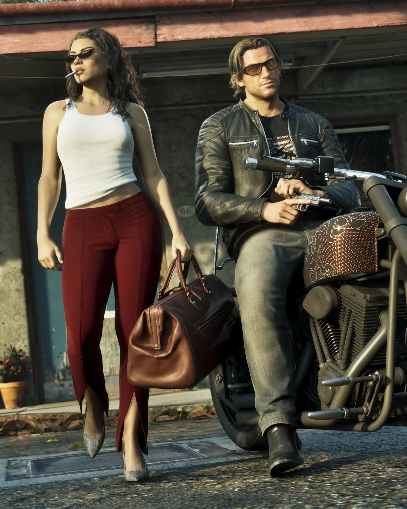
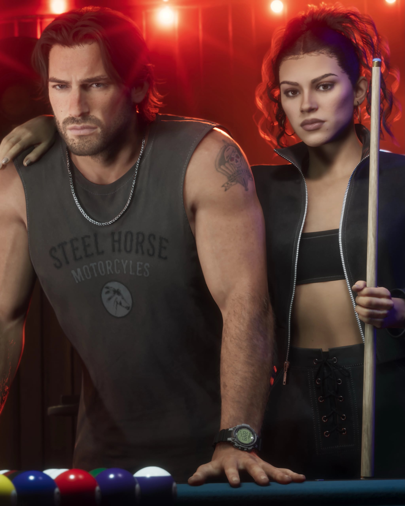

Quattro nuovi screenshot di Grand Theft Auto VI mostrano Jason e Lucia
insieme. Compaiono nel numero 27 di LOVE magazine, che mette la coppia in
copertina. Il numero contiene anche un'intervista al team narrativo di
Rockstar Games.

LOVE magazine ha condiviso le immagini e una parte dell'articolo venerdì 2
ottobre, riporta RockstarINTEL. IGN Benelux ne ha parlato il 4 ottobre. I
quattro screenshot non sono tra i download ufficiali del sito di Rockstar.

## Cosa mostrano gli screenshot

La copertina è un'illustrazione della coppia realizzata da Rockstar, con le
parole "America's Most Wanted" sopra il nome del gioco.

<figure>

<figcaption>La copertina del numero 27 di LOVE magazine. Illustrazione di Rockstar Games.</figcaption>

</figure>

Il primo screenshot è in bianco e nero. Jason è seduto su una sedia da
giardino con una bibita, in canottiera bianca e occhiali da sole. Lucia è in
piedi accanto a lui con un top leopardato e i jeans.

<figure>

<figcaption>Screenshot di GTA VI, condiviso da LOVE magazine.</figcaption>

</figure>

Nel secondo, i due siedono uno di fronte all'altra nei séparé di una tavola
calda americana. Entrambi tengono in mano una pistola. Accanto a Lucia c'è
una grande borsa. Secondo IGN Benelux è pensata per del denaro rubato. Cosa
succeda nella scena non è noto.

<figure>

<figcaption>Screenshot di GTA VI, condiviso da LOVE magazine.</figcaption>

</figure>

Il terzo mostra Jason su una moto con una giacca di pelle e una pistola in
mano. Lucia cammina accanto a lui con una sigaretta e una borsa da viaggio
marrone.

<figure>

<figcaption>Screenshot di GTA VI, condiviso da LOVE magazine.</figcaption>

</figure>

Nell'ultimo, i due sono a un tavolo da biliardo sotto una luce rossa. Jason
indossa una maglia smanicata di Steel Horse Motorcycles, Lucia tiene una
stecca. IGN Benelux colloca la scena in un bar di biker.

<figure>

<figcaption>Screenshot di GTA VI, condiviso da LOVE magazine.</figcaption>

</figure>

## Un sogno americano più modesto

Rupert Humphries è senior vice president della narrativa di Rockstar.
Racconta a LOVE che una versione del mondo di oggi in un gioco deve essere
più esagerata di quella reale. Altrimenti i giocatori potrebbero
semplicemente uscire di casa, dice. L'obiettivo è una satira più grande del
vero, non uno specchio.

Lucia doveva essere una persona che vuole una vita migliore e che niente può
fermare, secondo Humphries. Il sogno americano oggi forse è più modesto, dice.
È una casa per la propria famiglia e i prestiti estinti, non un successo
sfrenato. Miami e il sud della Florida sono in prima linea su questo, nelle
sue parole.

## Due sceneggiatrici su Jason e Lucia

La sceneggiatrice Elizabeth Gauvey-Kern racconta a LOVE che entrambi i
protagonisti dovevano essere vulnerabili, duri e imperfetti. A volte hanno
ragione e a volte torto, e imparano l'uno dall'altra. Questo li ha resi
autentici e una bella squadra, dice.

La sceneggiatrice Alexa D'Agostino aggiunge che una persona pienamente
realizzata, con i propri desideri, risulta perfettamente imperfetta. Un
personaggio così ha dei cliché, ma resta innegabilmente reale, dice.

Anche Rob Nelson, co-direttore dello studio Rockstar North, è intervistato
nel numero, scrive RockstarINTEL. Cosa dica non è ancora noto.

## Il numero

Il numero 27 costa 25 euro e arriva in edicola il 5 ottobre, riportano
diversi siti di videogiochi. I preordini della copertina di GTA VI presso il
distributore francese KD Presse sono andati esauriti in pochi minuti,
secondo gli stessi siti.

GTA VI esce il 19 novembre.
