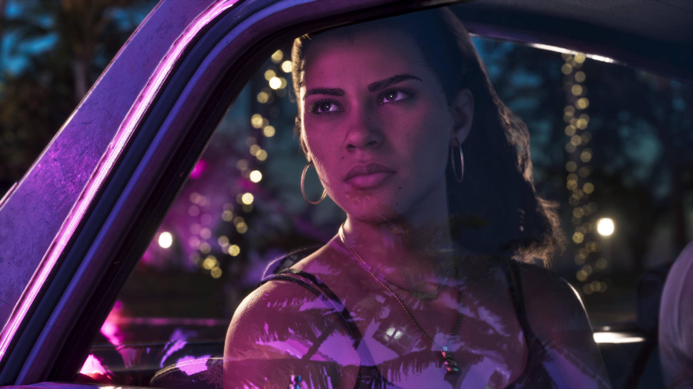
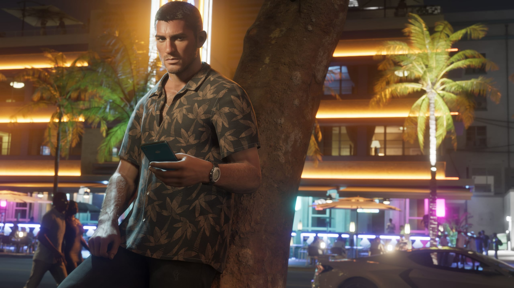

Jason e Lucia, i due protagonisti di Grand Theft Auto VI, appaiono molto più
dettagliati che nel primo trailer, scrive IGN. Pelle, capelli e
illuminazione sono stati tutti rifiniti da dicembre 2023. GTA VI esce il
mese prossimo.

Rockstar Games ha mostrato ufficialmente GTA VI per la prima volta a
dicembre 2023. Prima di allora era già trapelato molto gameplay. Il primo
trailer è stato il primo sguardo ufficiale al gioco.

## Il primo trailer

Nel primo trailer la pelle di Lucia appare piuttosto liscia, con meno
dettagli sul viso, secondo IGN. I capelli si muovono meno e porta la stessa
acconciatura per gran parte del trailer. Jason compare poco. Ha la testa
rasata e un po' di barba.

## Il secondo trailer

Il secondo trailer, di maggio 2025, mostra molte più versioni dei due
personaggi. Lucia compare con i capelli mossi e un vestito dorato. Jason ha
i capelli castani sotto il cappellino. Sembra sudato nel caldo di Vice City,
le vene sono visibili sulle braccia e la barba è meno uniforme.

<figure>

<figcaption>Screenshot ufficiale, Rockstar Games.</figcaption>

</figure>

<figure>

<figcaption>Screenshot ufficiale, Rockstar Games.</figcaption>

</figure>

Anche la luce cade in modo più naturale sulla loro pelle, scrive IGN.
Piccole imperfezioni fanno sembrare i due meno simili a modelli digitali
levigati. Le diverse acconciature e i diversi abiti potrebbero indicare
quanto i giocatori potranno cambiare l'aspetto di Jason e Lucia. Quanta
libertà avranno i giocatori non è noto.

<figure>

<figcaption>Screenshot ufficiale, Rockstar Games.</figcaption>

</figure>

<figure>

<figcaption>Screenshot ufficiale, Rockstar Games.</figcaption>

</figure>

## Una dichiarazione d'intenti

L'extended look del 27 agosto mostra un salto minore di quello tra i primi
due trailer. La differenza con il primo trailer è ormai evidente, secondo
IGN.

Rob Nelson, co-responsabile di Rockstar North, aveva spiegato a GamesRadar
che il primo trailer era soprattutto una dichiarazione d'intenti per il
team. In quel momento il gioco non aveva ancora una forma completa. Il
trailer serviva da bussola per la direzione dello sviluppo.

<figure>

<figcaption>Screenshot ufficiale, Rockstar Games.</figcaption>

</figure>

<figure>

<figcaption>Screenshot ufficiale, Rockstar Games.</figcaption>

</figure>

GTA VI esce il 19 novembre per PlayStation 5 e Xbox Series X e S.
