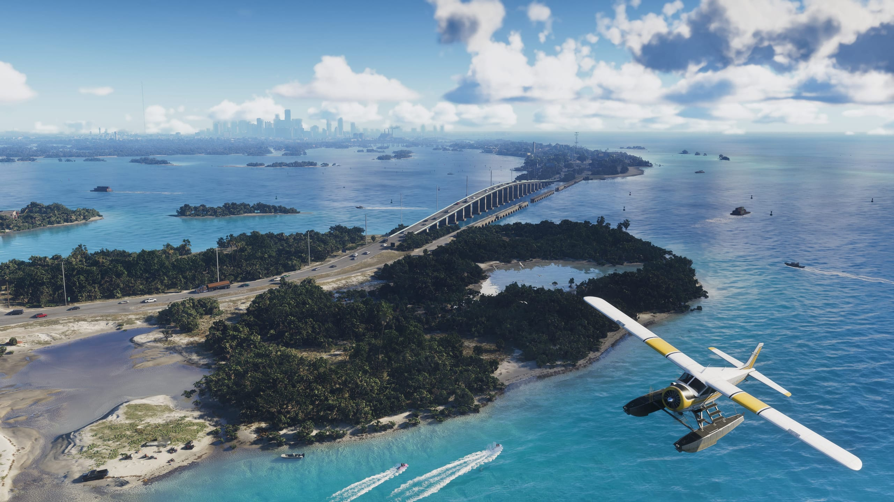
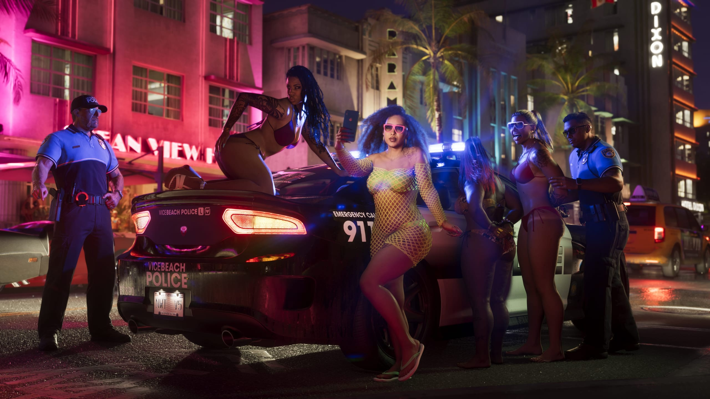
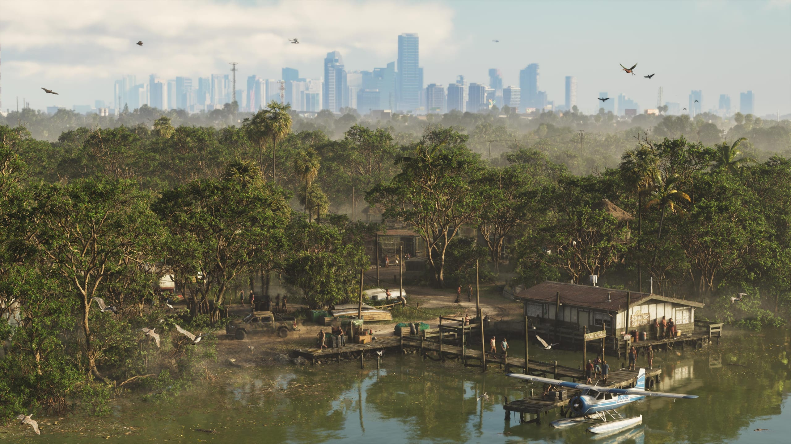

Gli sviluppatori di Rockstar Games hanno girato la Florida con poliziotti e
membri di gang per le ricerche su Grand Theft Auto VI. Lo racconta Aaron
Garbut, co-direttore dello studio e responsabile dello sviluppo di Rockstar
North, nel numero 27 di LOVE magazine.

Il numero è in edicola da lunedì 5 ottobre. IGN Benelux e Dexerto hanno
parlato dell'intervista lo stesso giorno. Fa parte del lungo servizio su GTA
VI che LOVE aveva annunciato la settimana scorsa con quattro nuovi
screenshot.

## Da Miami a Key West

Ogni gioco di Rockstar comincia con dei viaggi di ricerca, spiega Garbut a
LOVE. In quei viaggi il team esplora in gruppo sia il luogo sia le proprie
idee, dice.

Per GTA VI, un piccolo gruppo ha prima passato del tempo a Miami e nelle
città vicine. Da lì il team ha attraversato le Florida Keys fino a Key
West. Hanno registrato luoghi e discusso di come portarli nel gioco. In
seguito gruppi più grandi di sviluppatori sono tornati per studiare
alcune zone più nel dettaglio.

<figure>

<figcaption>Le Leonida Keys, l'equivalente delle Florida Keys in GTA VI. Screenshot ufficiale, Rockstar Games.</figcaption>

</figure>

## Con i poliziotti e con le gang

Il team non ha guardato solo edifici e paesaggi. Secondo Garbut, hanno
passato del tempo con la gente del posto e ascoltato più storie possibili.
Hanno viaggiato con poliziotti e con membri di gang, dice.

Alcune delle persone incontrate potevano fare paura, ammette Garbut.
Eppure chi ha accompagnato il team era tra le persone più gentili che
avessero mai conosciuto, scrive Dexerto. Le storie, i luoghi e i dettagli
potevano essere terrificanti, dice. IGN Benelux scrive che il team ha
visto anche il lato più basso della società.

<figure>

<figcaption>La Vice Beach Police di notte a Vice City. Screenshot ufficiale, Rockstar Games.</figcaption>

</figure>

## Un giorno in elicottero

La ricerca si è spinta anche in aria. Garbut ha passato un giorno intero in
elicottero con altri art director. Hanno filmato le Everglades, le
mangrovie, il centro di Miami e la costa.

A un certo punto l'elicottero ha volato basso sopra le insenature tra le
mangrovie ed è finito sospeso sopra uno stadio durante un concerto di
Beyoncé. Garbut pensa che per questo siano finiti nel telegiornale locale,
riporta Dexerto.

<figure>

<figcaption>Grassrivers, la palude di Leonida ispirata alle Everglades. Screenshot ufficiale, Rockstar Games.</figcaption>

</figure>

## Un luogo di estremi

Per Rockstar, in GTA VI contano i contrasti della Florida. IGN Benelux
riassume come lo studio descrive Miami: un luogo di estremi, dove grande
ricchezza e profonda povertà convivono. A questo si aggiungono eccessi,
caos e una spinta costante ad avere successo.

Il team ha studiato anche abiti, acconciature, cosmetici e i diversi
gruppi della società. Così gli abitanti di Leonida devono risultare
credibili. Secondo Rockstar, alcune esperienze di quei viaggi sono finite
nel gioco in modo sorprendentemente diretto. Quali siano non si sa.

## Un nuovo screenshot nel numero

Il numero stampato contiene un altro screenshot che LOVE non aveva
condiviso la settimana scorsa. È in bianco e nero. Jason si appoggia a
braccia conserte a una vecchia auto, mentre Lucia è seduta sul cofano con
un revolver. L'utente di X topkaj777 ha fotografato la pagina e videotech
l'ha condivisa lunedì mattina.

<blockquote class="twitter-tweet" data-dnt="true">

New #GTAVI screenshot in Love Magazine via @topkaj777 https://t.co/JwncnzRIEO

<a href="https://twitter.com/videotech/status/2107000517490561219">ben (@videotech) su X, 5 ottobre 2026</a>

</blockquote>

Non è la prima volta che Rockstar parla delle ricerche per il gioco. IGN
Benelux aveva già riferito che alcuni sviluppatori erano stati in locali di
striptease per questo.

GTA VI esce il 19 novembre.
