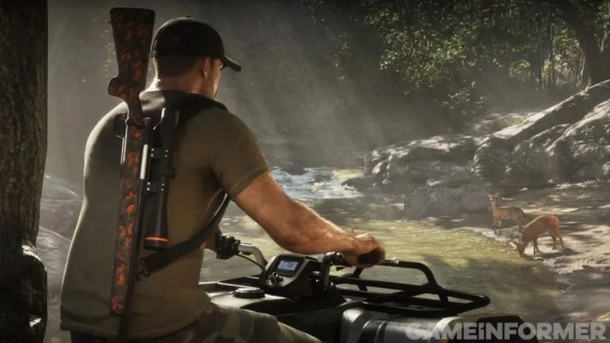

Game Informer heeft zijn grote preview van Grand Theft Auto VI gepubliceerd.
Daarin deelt Rockstar Games nieuwe details over het weer, de dieren en mensen
van Leonida, en de grootte van de map. Hieronder staan de belangrijkste
punten.

## Orkanen zijn bevestigd

Orkanen zitten in de game, bevestigt Rockstar aan Game Informer. Fans hoopten
erop, maar vroegen zich af of het technisch wel kon. Hoe vaak ze voorkomen en
of ze het verhaal beïnvloeden, zegt de studio nog niet.

Het verhaal beschrijft zware bewolking, harde wind, een dreigende sfeer en
regen die alles doorweekt. Water stroomt van dakranden en lantaarnpalen, de
donder rommelt en bliksem verlicht de wolken.

## Een herbouwd weersysteem, met regenbogen

Owen Shepherd, bij Rockstar verantwoordelijk voor belichting en rendering,
zegt dat de studio het weersysteem opnieuw heeft opgebouwd. Weer kan nu
plaatselijk, aanhoudend en dynamisch zijn. Spelers kunnen in de zon staan
terwijl er in de verte een bui hangt.

Er zijn regenbogen en plassen. Spelers kunnen door een gebied rijden en zien
dat het er net geregend heeft, ook als ze de bui zelf gemist hebben. Wind
zorgt voor rimpelingen op het water en laat haar wapperen.

## Twee keer zo groot als GTA V

Aaron Garbut, co-studiohoofd van Rockstar North, bevestigt dat de map twee
keer zo groot is als die van GTA V. De nadruk ligt op hoeveel de wereld bevat.
De game speelt zich af in Leonida, een fictieve versie van Florida.

Volgens Garbut werkte het team aan elk deel van de wereld: daken, steegjes,
interieurs en alles daartussen. Op een bepaald moment waren er zoveel
interieurs dat gebouwen van binnen en van buiten echt begonnen aan te voelen.
Hij noemt de wereld één samenhangend geheel, vol content en tot in de details
met de hand gemaakt.

## Zes regio's

De map heeft zes regio's. De bekendste is Vice City, uit GTA: Vice City van
2002. De andere zijn Leonida Keys, Grassrivers, Port Gellhorn, Ambrosia en
Mount Kalaga National Park.

Ambrosia is een landelijker gebied met fabrieken en raffinaderijen, in handen
van een motorbende. Dat lijkt een andere bende te zijn dan de Lost MC uit GTA
IV en GTA V.

## Een verhaal dat reist

Rockstar gebruikt het verhaal om spelers door de wereld te leiden en de
gebieden te tonen. Het komt niet in elke uithoek, maar het toont het contrast
tussen de rijkere en armere delen van Leonida.

## Snel reizen met een gedeelde rit

In eerdere GTA-games konden spelers een taxi nemen om de map over te steken.
Red Dead Redemption 2 was beperkter: reizen ging van plaats naar plaats, niet
naar elk punt op de map.

In GTA VI kunnen spelers een rit boeken en zich door de stad laten rijden. Dat
kan een gedeelde rit zijn, met andere passagiers in de auto en gesprekken met
hen.

## Snapmatic, maar zelf niets posten

Wie niet wil praten, kan scrollen door Snapmatic, de parodie op Instagram in
de game. Zelf posten kan niet. Jason en Lucia zijn op de vlucht en zouden
zichzelf in gevaar brengen door actief te zijn op sociale media.

## Activiteiten

Game Informer noemt een reeks activiteiten:

- Basejumpen
- Biljarten
- Trainen in sportscholen
- Kajakken
- Minigolfen
- Duiken
- Straat- en offroadraces
- Dierentuinen bezoeken
- Varen met een airboat
- Jetskiën

## Meer dan 170 diersoorten

Spelers kunnen meer dan 170 diersoorten tegenkomen en ermee interageren.
Daaronder zijn meer dan 60 vogelsoorten, ruim 30 landzoogdieren en allerlei
vissen en reptielen. De gameplayonthulling van augustus toonde al dat honden
te aaien zijn. Of dat ook voor andere dieren geldt, zoals katten, is niet
bekend.

Michael Kane, vicepresident dynamic art bij Rockstar, zegt dat het team de
gevarieerde dierenwereld van Florida zo getrouw mogelijk naar de leefgebieden
van Leonida wilde brengen. Dat gaat van de stad en het platteland tot
binnenwateren, de oceaan, de moerassen en de Everglades. Volgens Kane
onderzoeken de teams elk dier in detail, voor zijn uiterlijk en zijn
bewegingen.

## Zeedieren met eigen gedrag

In de zee leven verschillende soorten haaien, kwallen, walvissen, schildpadden
en roggen, bevestigt Rockstar. Elk dier beweegt op zijn eigen manier, en
spelers kunnen ze tegenkomen tijdens het duiken.

## Jagen lijkt terug te keren

Een screenshot in het verhaal toont Jason met een geweer op zijn rug, bij een
groep herten. Dat wijst erop dat jagen in een of andere vorm terugkeert,
schrijft IGN Benelux. In GTA V was het een klein onderdeel van de game. In Red
Dead Redemption 2 was het een veel groter systeem.

<figure>

<figcaption>Game Informer, 29 september 2026.</figcaption>
</figure>

Spelers kunnen dieren opsporen door hun sporen te volgen, zoals in Red Dead
Redemption 2. Er zijn ook zeldzame soorten, maar welke zegt Rockstar niet.

## Overvallen en de politie

Overvallen spelen een centrale rol, met veel vrijheid in de aanpak. Spelers
kiezen tussen samen of alleen, en luid of stil. Die keuzes bepalen hoe hard de
politie reageert.

Jason en Lucia kunnen de politie samen afschudden of zich opsplitsen, waarbij
een van hen het grootste deel van de achtervolging op zich neemt. Als de
politie een van de twee overmeestert, is het game over.

## Auto's stelen

Voor duurdere auto's is speciaal gereedschap nodig. Ook dan kunnen trackers en
beveiligingssystemen voor problemen zorgen. Een app die WAiNK heet, toont wat
een auto bij doorverkoop opbrengt, welke beveiliging hij heeft en wat het kost
om hem te houden. Een auto verkopen betekent een bezoek aan een heler.

## Romantiek en keuzes

Of de relatie tussen Jason en Lucia verder gaat dan vriendschap, bepaalt de
speler. Dates, aandacht voor telefoontjes en berichtjes, en kleine gebaren
zoals een deur openhouden of elkaars hand vasthouden brengen die verder.

Grote en kleine keuzes beïnvloeden zowel hun relatie als het verhaal als
geheel, bevestigt Rockstar. Dat moet redenen geven om de game meer dan eens te
spelen, met andere verhaallijnen bij een tweede keer.

## Voorbij de verwachtingen

Garbut zegt dat de druk op het project enorm is. Normaal geeft een studio
schaal op voor detail, of detail voor interactie. Voor GTA VI ging alles
omhoog, zegt hij: detail, omvang, variatie, schaal, interactie en dichtheid.

## Mensen en kleding

De NPC's verschillen in lengte, gewicht, huidtype en meer, volgens Rockstar.
Personages kunnen bruinen in de zon en moedervlekken hebben, en lichaamsvormen
verschillen per persoon.

GTA VI heeft de grootste collectie kleding en accessoires die Rockstar ooit
maakte. Wat NPC's dragen, hangt af van waar ze zijn. In armere buurten komt
versleten of vuile kleding vaker voor.

Volgens Kane passen kleuren, patronen en merken bij de omgeving en de sociale
situatie van elk personage. Dat geldt ook voor schoenen, sneakers, horloges,
zonnebrillen en petten met een culturele betekenis.

Grand Theft Auto VI verschijnt op 19 november voor PlayStation 5 en Xbox
Series X en S.
