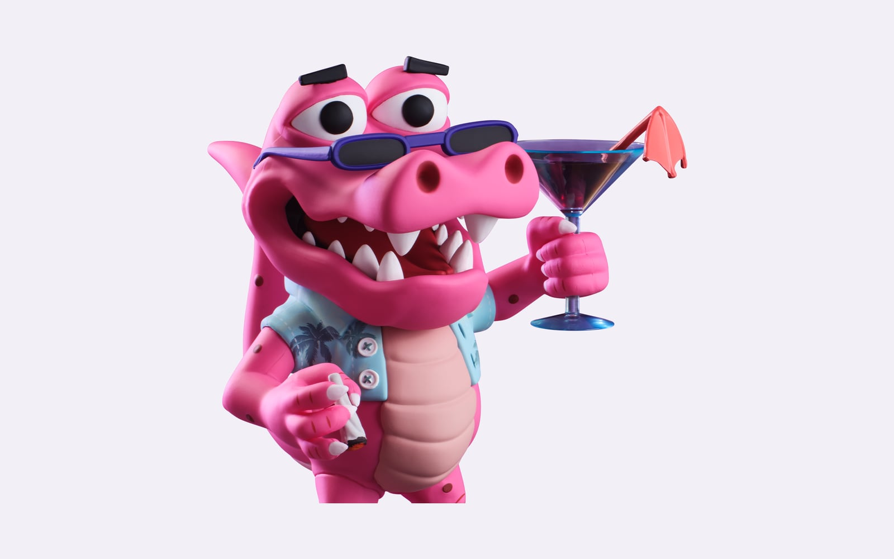
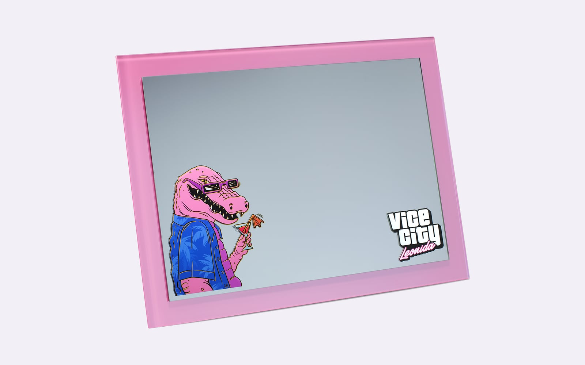
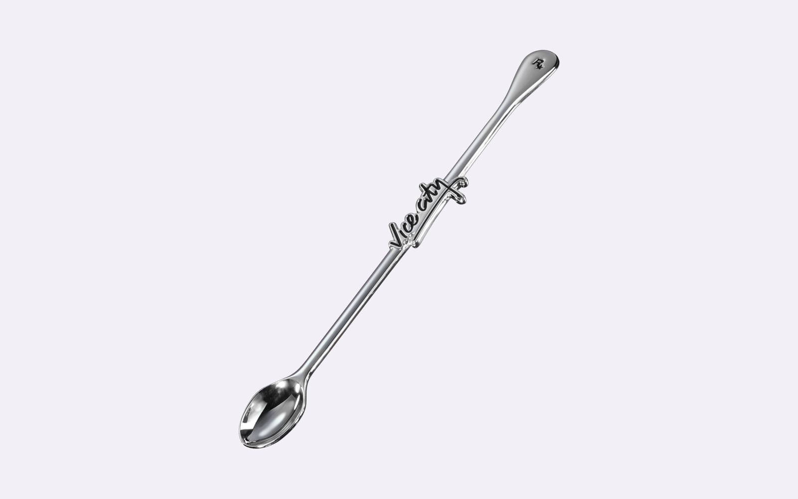
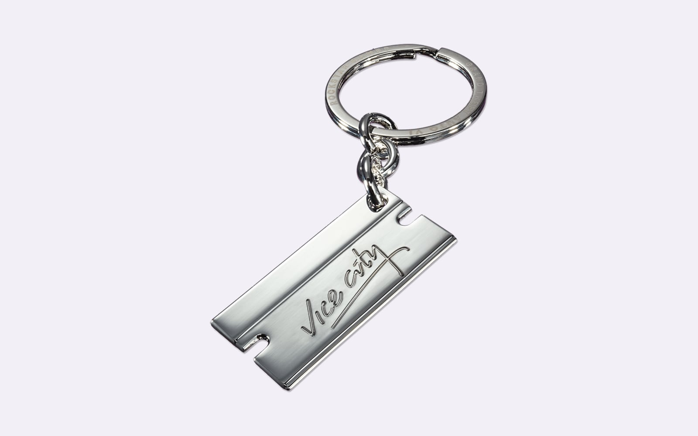
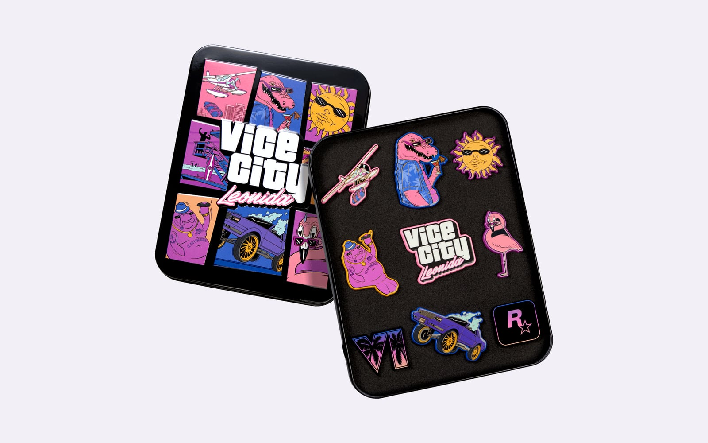
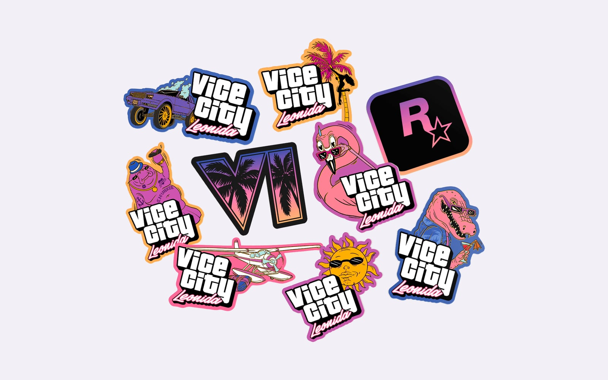
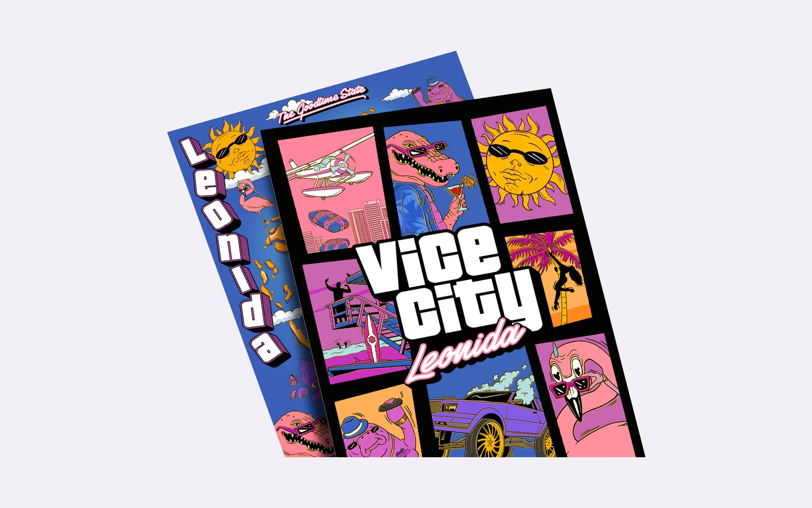
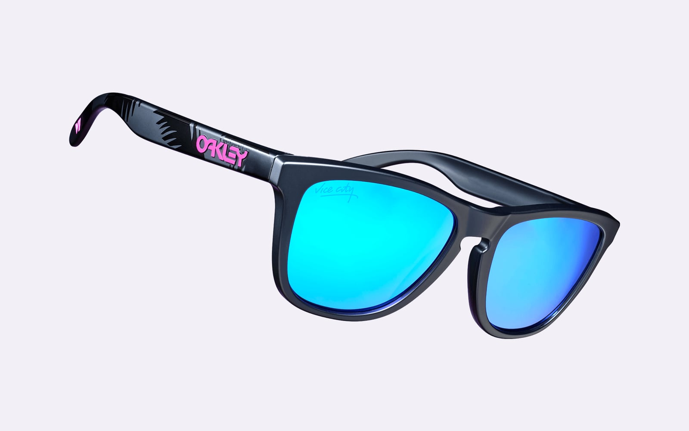
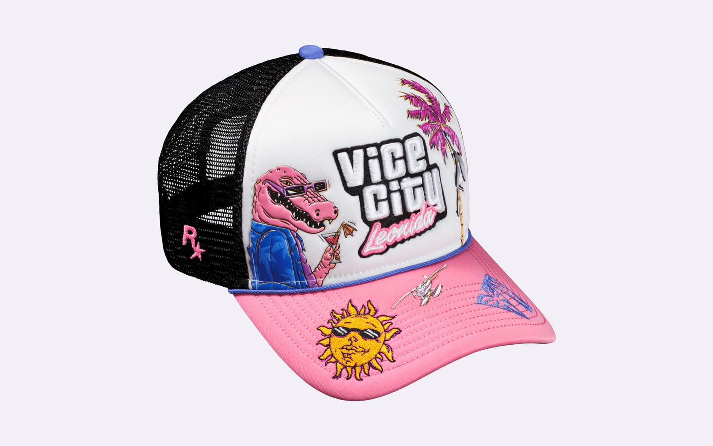
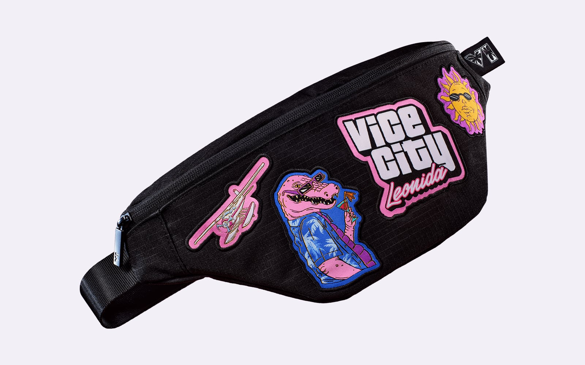

Rockstar Games heeft de pre-orders geopend voor een verzamelbox bij Grand
Theft Auto VI. De Vice City Collection bevat elf voorwerpen rond Macca the
Gator, een tv-programma in het spel. De box kost 399,99 euro en wordt op 19
november geleverd.

Rockstar kondigde de box op 24 september aan op zijn Newswire. Het is een
beperkte oplage, die alleen verkocht wordt zolang de voorraad strekt. De
volledige naam is The Goodtime State, en dat is de bijnaam van Leonida, de
staat waarin het spel zich afspeelt.

## Macca the Gator en zijn vrienden

Macca the Gator is een populair tv-programma in Leonida, schrijft Rockstar. De
getekende alligator staat op de meeste voorwerpen in de box, meestal met een
drankje in de hand. Chunkee the Manatee, een flamingo, een krab en een zon met
zonnebril zijn zijn vrienden uit het programma.

Alle elf de voorwerpen staan op de
[pagina van de Vice City Collection](https://www.rockstargames.com/VI/vice-city-collection)
van het spel. De beschrijvingen hieronder komen van die pagina en van de
productpagina in de Rockstar Store.

## Acht verzamelobjecten

Het pronkstuk is een beeldje van Macca van 6 inch, ongeveer 15 centimeter. Hij
geniet van een sigaret en een flamingo blood martini, schrijft Rockstar. De
voet draait open en dient als bergplaats.

<figure>

<figcaption>Het beeldje van Macca the Gator. Rockstar Games, 24 september 2026.</figcaption>
</figure>

De magnetische spiegel is van gegalvaniseerd roze glas, met Macca in de hoek.
Hij kan dienen als dienblad, of aan de muur hangen met twee grote magneten op
de achterkant.

<figure>

<figcaption>De magnetische spiegel van Macca the Gator. Rockstar Games, 24 september 2026.</figcaption>
</figure>

Het shotglas toont Chunkee the Manatee op de voorkant. Het logo van Rockstar
Games is met een laser in de bodem gegraveerd.

<figure>

<figcaption>Het shotglas van Chunkee the Manatee. Rockstar Games, 24 september 2026.</figcaption>
</figure>

Een decoratief roerlepeltje draagt een geëmailleerd Vice City-logo op de lange
steel. Het uiteinde van het handvat is een logo van Rockstar Games.

<figure>

<figcaption>Het Vice City-roerlepeltje. Rockstar Games, 24 september 2026.</figcaption>
</figure>

De sleutelhanger is een metalen scheermesje. De logo's van GTA VI en Vice City
staan er in reliëf op.

<figure>

<figcaption>De Vice City-sleutelhanger in de vorm van een scheermesje. Rockstar Games, 24 september 2026.</figcaption>
</figure>

Negen geëmailleerde pins zitten in een eigen metalen blik. Ze dragen de naam
van Leonida Keys, een van de regio's van de staat, net als de tas en de
stickers.

<figure>

<figcaption>De set pins van Leonida Keys. Rockstar Games, 24 september 2026.</figcaption>
</figure>

Negen vinylstickers zitten in een klein opbergzakje.

<figure>

<figcaption>De stickerset van Leonida Keys. Rockstar Games, 24 september 2026.</figcaption>
</figure>

De souvenirposter is aan twee kanten bedrukt. De voorkant toont de personages
van Macca the Gator. De achterkant toont de volledige kaart van Leonida,
schrijft Rockstar. Of dat de kaart van het spel zelf is, is niet bekend.

<figure>

<figcaption>De dubbelzijdige souvenirposter. Rockstar Games, 24 september 2026.</figcaption>
</figure>

## Drie voorwerpen om te dragen

De zonnebril is een Oakley Frogskins in mat zwart, met glazen van het type
Prizm Sapphire. Het logo van GTA VI staat in Vice City-roze op het montuur.

<figure>

<figcaption>De Oakley Frogskins-zonnebril. Rockstar Games, 24 september 2026.</figcaption>
</figure>

De pet is een New Era 9FORTY A-Frame snapback. Hij draagt borduursel en
applicaties van Vice City Leonida, met Macca op de voorkant.

<figure>

<figcaption>De New Era 9FORTY snapback. Rockstar Games, 24 september 2026.</figcaption>
</figure>

De crossbodytas is van ripstop, met een zwart en roze gevoerde binnenkant. Hij
draagt geweven badges en een YKK-ritstrekker met een eigen ontwerp.

<figure>

<figcaption>De crossbodytas van Leonida Keys. Rockstar Games, 24 september 2026.</figcaption>
</figure>

## Prijs, afmetingen en verzending

De box kost 399,99 euro in de Rockstar Store, en gratis verzending geldt er
niet voor. Hij meet 48 bij 34 bij 32 centimeter. De winkel noemt hem een
verzamelobject voor volwassenen, vanaf 18 jaar. Het spel zelf zit er niet bij.

Hoeveel boxen er gemaakt worden, zegt Rockstar niet. De pre-orders in Azië,
Latijns-Amerika en Australië volgen later, aldus de Newswire. Er komen
binnenkort ook meer kleding en verzamelobjecten uit de Grand Theft Auto VI
Collection naar de winkel.

Grand Theft Auto VI verschijnt op 19 november voor PlayStation 5 en Xbox
Series X en S.
